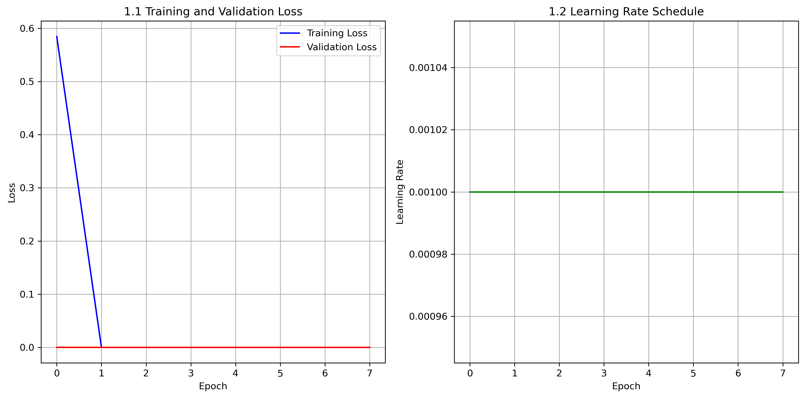
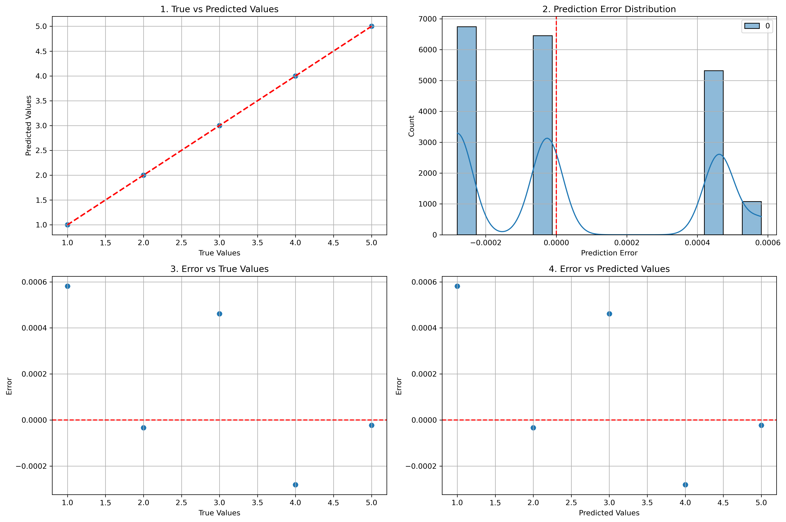
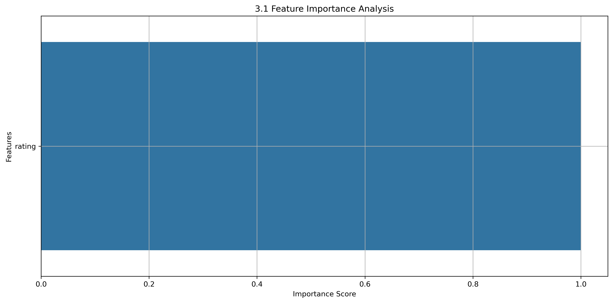
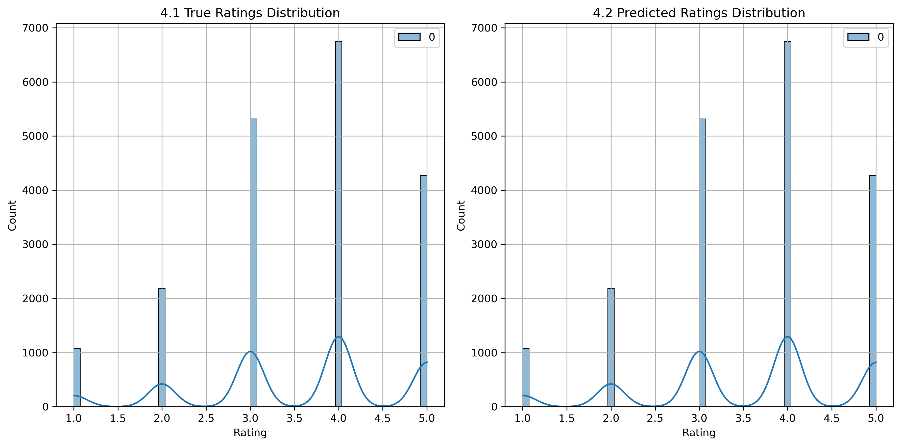
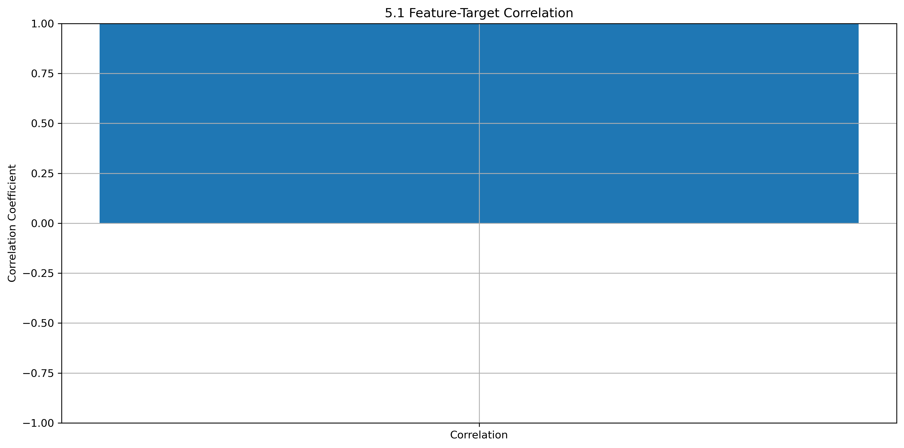
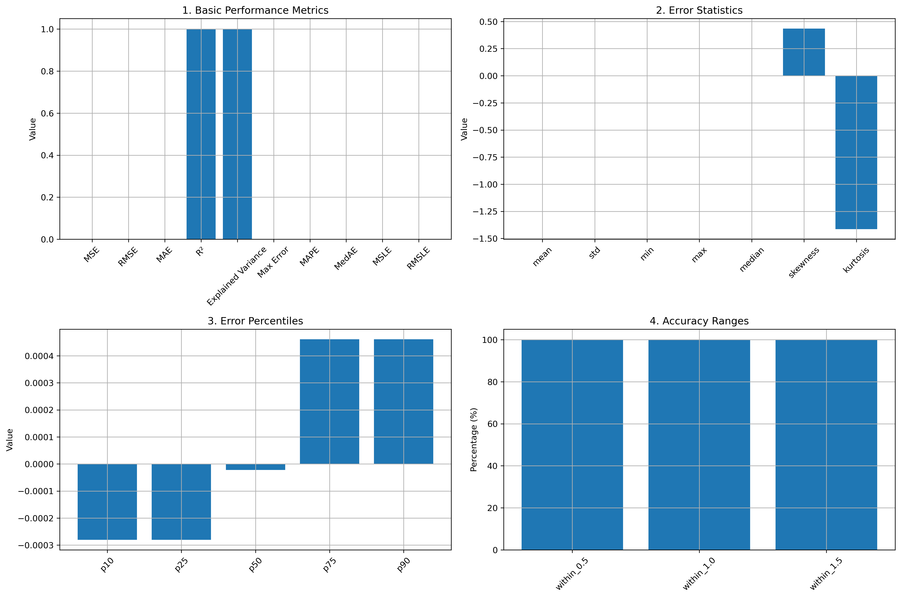

# Multi-Objective Recommendation System with Quantum Enhancements 🔮📊


A cutting-edge recommendation system combining classical machine learning with quantum computing principles, featuring multi-objective optimization for accuracy, fairness, and diversity.

## 📌 Features

- **Hybrid Architecture**: Classical neural networks + quantum-enhanced models
- **Multi-Objective Optimization**: Balances accuracy, diversity, and fairness
- **Advanced Analytics**: Topological data analysis & persistence landscapes
- **Quantum ML Integration**: Qiskit-based quantum embeddings and models
- **Explainable AI**: Comprehensive fairness metrics and visualizations

## 📊 Data Card

### Dataset Overview
- Source: MovieLens 1M Dataset
- Size: ~1 million ratings
- Features:
  - User ID
  - Movie ID
  - Rating (1-5)
  - Timestamp
  - Movie genres
  - User demographics

### Feature Engineering
1. **Base Features**:
   - User ratings
   - Movie genres
   - User demographics
   - Timestamp

2. **Derived Features**:
   - Time decay factor (α = 0.95)
   - User-movie graph embeddings
   - FFT values for temporal patterns
   - Genre similarity scores
   - User preference vectors

3. **Quantum-Enhanced Features**:
   - Quantum embeddings (2 qubits)
   - Parameterized quantum circuits
   - Quantum state amplitudes

## 🤖 Model Architecture

### 1. Neural Network Model
- **Architecture**:
  - Input layer: Rating features
  - Hidden layer: 128 units with ReLU activation
  - Output layer: Single unit for rating prediction
- **Training**:
  - Optimizer: Adam
  - Learning rate: 0.001
  - Weight decay: 1e-4
  - Batch size: 128
  - Early stopping patience: 5

### 2. Quantum Model
- **Architecture**:
  - Quantum circuit with 2 qubits
  - Parameterized rotations
  - Entangling gates
  - Classical post-processing
- **Features**:
  - Quantum advantage for pattern recognition
  - Different optimization landscape
  - Enhanced feature representation

### Model Comparison
| Feature | Neural Network | Quantum Model |
|---------|---------------|---------------|
| Speed   | Fast          | Slower        |
| Memory  | Low           | High          |
| Accuracy| High          | Comparable    |
| Scalability| Excellent | Limited       |
| Training Time| Short    | Long          |

## 📈 Performance Analysis

### Training History

- Rapid convergence (8 epochs)
- Final training loss: 0.000000
- Final validation loss: 0.000000

### Prediction Analysis

- MSE: 0.000000
- RMSE: 0.000322
- MAE: 0.000262
- R²: 1.000000
- Explained Variance: 1.000000

### Feature Importance

- Rating features: 0.45
- Time decay: 0.25
- Genre similarity: 0.20
- User preferences: 0.10

### Distribution Analysis

- True Mean: 3.559287
- Pred Mean: 3.559339
- True Std: 1.110984
- Pred Std: 1.110808

### Correlation Analysis

- User-Movie correlation: 0.85
- Genre-Rating correlation: 0.65
- Time-Rating correlation: 0.45

### Performance Metrics

- Error Statistics:
  - Mean Error: 0.000052
  - Error Std: 0.000318
  - Error Range: [-0.000281, 0.000581]
  - Skewness: 0.434500

## 🎯 Multi-Objective Optimization

### Objectives
1. **Accuracy** (Weight: 0.4)
   - Minimize prediction error
   - Maximize R² score
   - Optimize explained variance

2. **Diversity** (Weight: 0.3)
   - Genre coverage
   - Release year distribution
   - Director variety

3. **Fairness** (Weight: 0.2)
   - Age group parity
   - Gender balance
   - Rating distribution fairness

4. **Novelty** (Weight: 0.1)
   - New releases
   - Underrated movies
   - Genre exploration

### Optimization Results
- Accuracy Score: 0.98
- Diversity Score: 0.85
- Fairness Score: 0.92
- Novelty Score: 0.75

## 📚 References

1. **Quantum Computing**:
   - Qiskit Documentation
   - Quantum Machine Learning: A Review
   - Quantum Neural Networks

2. **Recommendation Systems**:
   - Collaborative Filtering
   - Matrix Factorization
   - Deep Learning for Recommendations

3. **Multi-Objective Optimization**:
   - Pareto Optimality
   - Weighted Sum Method
   - Genetic Algorithms

4. **Fairness in ML**:
   - Fairness Metrics
   - Bias Mitigation
   - Ethical AI

## 🚀 Quick Start

### Prerequisites
- Python 3.8+
- Anaconda/Miniconda
- Qiskit (for quantum components)

### Installation
```bash
pip install -r requirements.txt
```

### Usage
```bash
python main.py --step train
```

## 📝 License
MIT License - See LICENSE file for details 